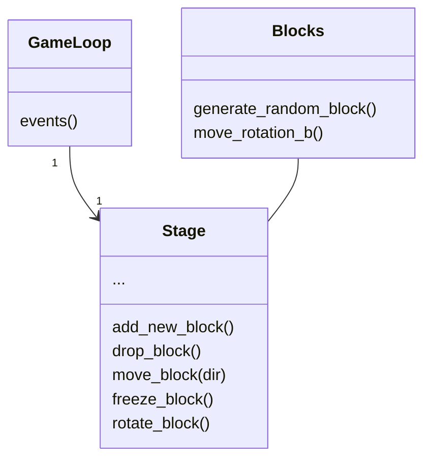
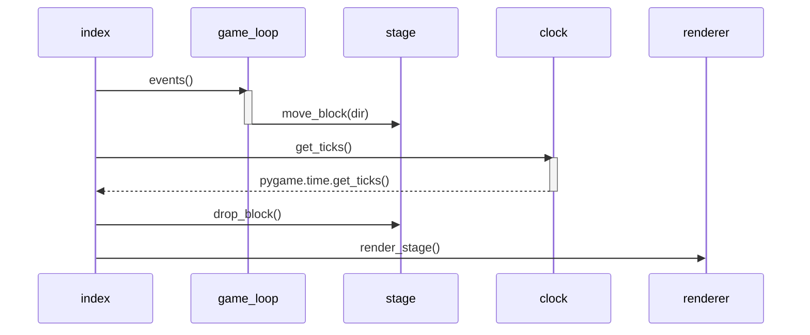

# Sovelluslogiikka

Luokka GameLoop lukee pelaajan syötettä jota luokka Stage käyttää palikan liikuttamiseen pelikenttänssä.

# Sekvenssikaavio

Sekvenssiokaavio kun palikkaa liikutetaan oikealle tai vasemmalle. Sen lisäksi palikkaa tiputetaan yhden tilan verran kun tarpeeksi aikaa on kulunut.
