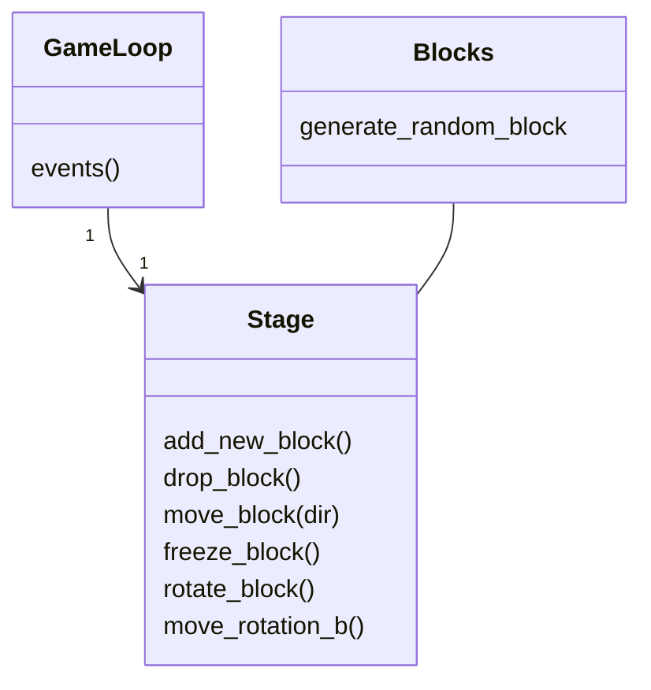

# Sovelluslogiikka

```mermaid
  classDiagram
      GameLoop "1" --> "1" Stage
      Blocks -- Stage
class GameLoop{
      events()
	}
class Stage{
      add_new_block()
      drop_block()
      move_block(dir)
      freeze_block()
      rotate_block()
      move_rotation_b()
	}
class Blocks{
      generate_random_block
	}
```

Luokka GameLoop lukee pelaajan syötettä jota luokka Stage käyttää palikan liikuttamiseen pelikenttänssä.
